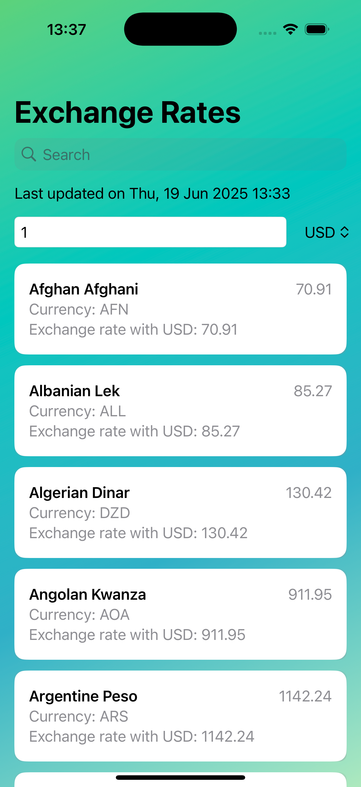

## Overview

OpenExchangeRates is an iOS application built using Swift and SwiftUI. It retrieves and displays currency exchange rates from external APIs. The app leverages MVVM architecture, utility services, timer-based API polling, and property wrappers for efficient and maintainable code.



## Open Exchange Rates Application
## Features and Requirements

1. API will be called to fetch the exchange rates available at the current moment
2. Exchange rates will be calucuated based on the **base price of US value**.
3. API will be called for **every 30 minutes only** to minimise the API calls on every launch
4. Once the response is received we will be storing the same in URL Cache along with the time stamp.
5. Once the stored time stamp is reached to 30 minutes then service call will be initiated again to get the exchange rates.
6. User can be able to **select the currency from the list of currencies provided**.
7. User can be able to enter the desired amount for the selected currency and exchange rates will be displayed accordingly.
8. If exchange rate for a selected country is not available then conversion is based on the base price.
9. On conversion, floating point errors are handled and conversion type can be provide in the config file.
10. User can be able to **search for desired country** to see the exchange rate with selected currency.

## Unit test cases included for business logic.
---

## Project Structure

```
OpenExchangeRates
├── OpenExchangeRatesApp.swift          # App entry point
├── ViewModel
│   └── ExchangeRatesViewModel.swift    # ViewModel handling business logic
├── Util
│   ├── Configs
│   │   └── URLConfigs.swift            # API endpoints
│   ├── Extensions
│   │   ├── Date+Extension.swift        # Date utilities
│   │   ├── Double+Extension.swift      # Double formatting
│   │   ├── URLRequest+Extension.swift  # Request helpers
│   │   ├── Data+Extension.swift        # Data parsing helpers
│   │   └── View+Extension.swift        # SwiftUI extensions
│   ├── PropertyWrapers
│   │   └── UserDefault+PropertyWrapper.swift  # Persistence with UserDefaults
│   └── TimerServices
│       ├── APITimerSettings.swift      # Timer settings for API polling
│       ├── APITimerService.swift       # Timer service logic
│       └── APITimerValidator.swift     # Timer validation
├── Info.plist                          # App configuration
├── Tests
│   ├── MockCurrencyService.swift       # Mock service for currency data
│   ├── MockExchangeRateService.swift   # Mock service for exchange rates
│   └── OpenExchangeRatesTests.swift    # Unit tests
└── README.md                           # Project documentation
```

---

## Key Features

* MVVM architecture for clean separation of concerns
* SwiftUI interface for modern UI development
* Periodic API polling using a custom timer service
* UserDefaults property wrappers for local data persistence
* Utility extensions for reusable, clean code
* Unit tests with mock services for reliable testing

---

## Requirements

* Xcode 13+
* iOS 14+
* Swift 5.5+

---

## Setup and Run

1. Clone the repository.
2. Open `OpenExchangeRates.xcodeproj` with Xcode.
3. Build and run the app on a simulator or device.

---

## Testing

* Select the `OpenExchangeRatesTests` target.
* Press `Cmd + U` to execute unit tests in Xcode.

---

## License

This project is for educational and demonstration purposes.
